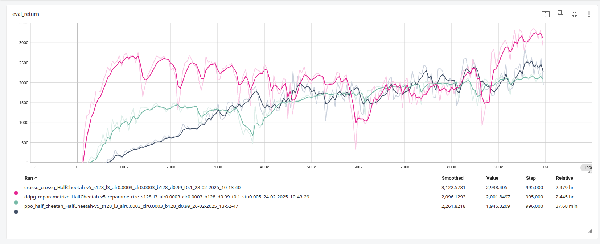
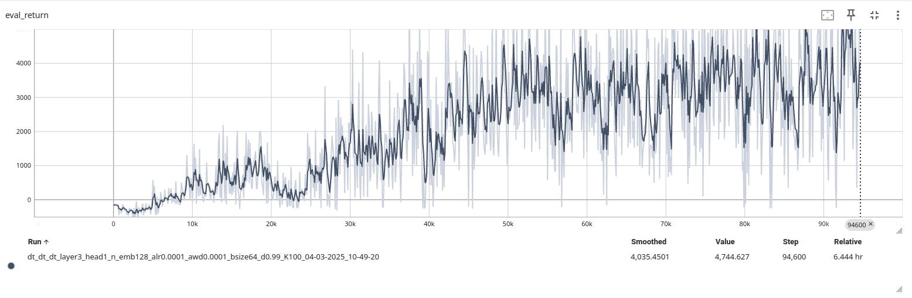
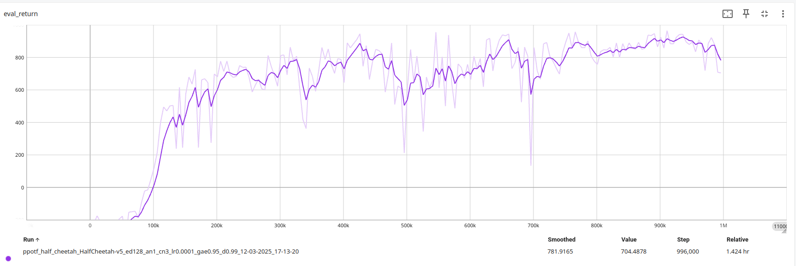
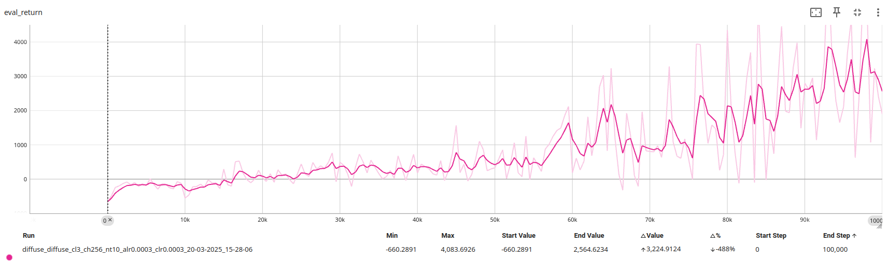
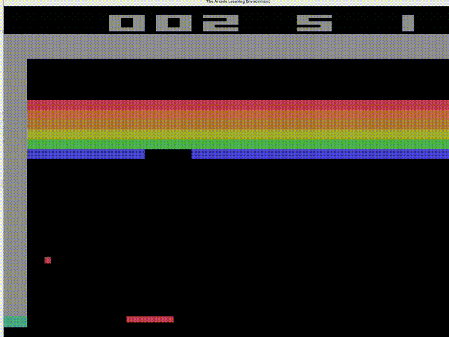

# Reinforcement Learning Algorithms
This repository contains a list of reinforcement learning algorithms. Supported algorithms:
- DDPG (SAC)
- SAC with Reinforce type update
- PPO
- PPO with Transformer as both actor and critic
- CrossQ
- Decision Transformer
- QLearning with Diffusion Policy

## Experimental Results
### Evaluation rewards on halfcheetah task:
1. Algorithms explore the environment directly (DDPG, PPO, CrossQ)

2. Decision Transfrormer trained by `mujoco/halfcheetah/medium-v0` dataset

3. PPO with Transformer 

4. Q-Learning with diffusion policy trained by `mujoco/halfcheetah/medium-v0` dataset


### Breakout-V5
1. SAC with reinfornce typed update


## Install The Package
Follow these steps to set up the environment
1. Create a new virtual environment:
```shell
conda create -n rl_env python=3.12
conda activate rl_env
```
2. Intall PyTorch:
```shell
pip3 install torch torchvision torchaudio --index-url https://download.pytorch.org/whl/cu126
```

3. Install other dependence
```shell
pip3 install -r ./requirements.txt
```

4. Install the package in development mode
```shell
pip3 install -e .
```
# Run an Example
To run an example, use the following command:
```shell
python ./scripts/run_ddpg.py -cfg ./experiments/ddpg/halfcheetah_reparametrize.yaml
```
I use tensorboard to log trainning results. To view them, you can use the following command:
```shell
tensorboard --logdir ./data
```

## Acknowledgements

This project was inspired by and adapted from the following repositories:
- [Berkeley CS285](https://github.com/berkeleydeeprlcourse/homework_fall2023)
- [NonGPT](https://github.com/karpathy/nanoGPT)
- [Decision Transformer](https://github.com/kzl/decision-transformer)